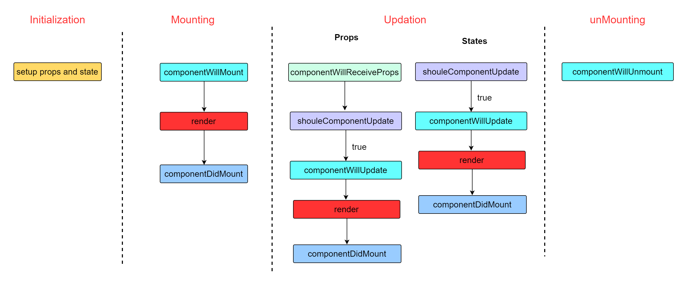

# react 核心知识总结

## jsx

### react 元素

react 元素是 react 应用的最小单位，它描述了你在屏幕上看到的内容，react 元素的本质其实是一个 js 对象。

```js
const element = <h1 id="title">hello</h1>;
console.log(element);
```

我们打印这个 element 可以发现它实际上就是一个普通的 js 对象。

```js
{
  $$typeof: Symbol(react.element),
  key: null,
  props:{id: "title", children: "hello"},
  ref:null,
  type:"h1"
}
```

事实上 react 中的元素就是通过 babel 转义得到的一个对象，我们可以看下 babel 转义的实现：

```js
const element = React.createElement("h1", { id: title }, 123);
```

我们可以看下它的核心其实是`createElement`方法，我们尝试自己实现一个简单的`createElement`方法。

```js
function createElement(type, config = {}, ...children) {
  return {
    $$typeof: Symbol("react.element"),
    props: { ...config, children },
    type,
  };
}
```

我们可以发现`createElement`实际上就是根据传入的几个参数，type,config 和 children 返回一个对象，这个对象其实就是虚拟 DOM。真正地渲染成真实 DOM 还需要依靠 ReactDOM。它能够保证浏览器中的 DOM 和你的虚拟 DOM 一致。

### JSX 表达式

表达式就是变量和操作符的集合，可以计算结果，比如常见的 a+b,1+2,let a = 1 等。
JSX 表达式就是在 JSX 中可以任意使用表达式，但是表达式要放在大括号里,也就是说在大括号中可以放置任何表达式。示例：

```js
let title = "world";
const element = (
  <h1 id="title">
    hello,<span>{title}</span> // title作为一个变量进行表达式
  </h1>
);
```

### React 如何区分 JSX 元素和 JSX 的表达式

凡是以`<`开头的被视为是 JSX 元素，以`{}`进行包裹的视为是 JSX 表达式。

### JSX 本质是一个对象，可以作为变量，参数，返回值

JSX 它的本质是一个对象，因此它可以作为一个变量，进行表达式计算；也可以作为函数的参数或者返回值。示例：

```js
function greeting(name) {
  if (name) {
    return <h1>hello,{name}</h1>;
  } else {
    return <h1>hello,world</h1>;
  }
}
const element = greeting("jsx");
ReactDOM.render(element, document.getElementById("root"));
```

如上所示，JSX 作为函数的返回值，最终被展示在页面中。其实，JSX 元素 作为返回值最常用的就是生成列表。

```js
let list = ["张三", "李四", "王五"];
const element = list.map((item) => {
  return <li>{item}</li>; // 作为函数的返回值
});
ReactDOM.render(<ul>{element}</ul>, document.getElementById("root"));
```

如上所示，由于 jsx 是用于描述 DOM 结构的，在页面中经常会存在各种各样的列表，这些列表都是通过数组数据展示得到的，因此，我们通常需要将数组转化成 JSX 列表，使用方法就是通过 map 进行转化。map 返回的就是一个 JSX 元素。

### JSX 元素的更新-JXS 元素的不可变性

1. JSX 元素是不可变对象，更新时创建新的
   JSX 元素是不可变的。我们都知道 JSX 元素实际上是一个这样的对象，

```js
{
  $$typeof: Symbol(react.element),
  key: null,
  props:{id: "title", children: "hello"},
  ref:null,
  type:"h1"
}
```

而对象是可以直接操作它的属性的，那么我们如果想要修改页面中的内容，比如把`id = "title"`变成`id = "hi"`，可以直接使用`element.props.id = "hi"`吗？我们可以尝试一下：

```js
const element = <h1 id="title">hello</h1>;
function update() {
  element.props.id = "hi"; // 使用对象的方式去修改页面中元素的内容
  ReactDOM.render(element, document.getElementById("root"));
}

setInterval(update, 1000);
```

我们可以发现页面中出现了报错：

```js
Uncaught TypeError: Cannot assign to read only property 'id' of object '#<Object>' // 不能修改只读属性
```

也就是说 JSX 元素的所有属性都是只读的，不能直接进行修改，如果我们要更新页面中的内容，只能创建新的 JSX 元素。
示例：

```js
function update() {
  const element = <h1 id="title">hello,{Date.now()}</h1>; // 每次更新时创建新的JSX元素
  ReactDOM.render(element, document.getElementById("root"));
}

setInterval(update, 1000);
```

2. React 只会更新必要的部分
   React 只会更新部分必要的 DOM，如果 DOM Diff 之后发现没有变化，那么就不会进行更新。

```js
function update() {
  const element = (
    <h1 id="title">
      <p>hello</p> // 这里不会进行更新 ,{Date.now()} // 只更新这里
    </h1>
  );
  ReactDOM.render(element, document.getElementById("root"));
}
```

## 二. 组件和 Props

1. 可以将 UI 切分成一些独立的，可复用的部件，这样就只需要专注于构建每一个单独的部件。
2. 组件从概念上类似于 Javasript 函数，它接收任意的入参（即 props），并返回用于描述页面展示内容的元素。

### 2.1 函数组件

- 函数组件接收一个单一的 props 对象，并返回一个 React 元素

```js
function Greeting(props) {
  // 接收props作为参数
  return <h1>hello,{props.name}</h1>; // 返回一个React元素
}
```

- 如何渲染函数组件

1. 封装函数组件的属性对象 props = {name:"xxx"}
2. 把 props 传递给`Greeting`函数。
3. 把这个 React 这个元素，渲染到真实 DOM 上。

```js
function Greeting(props) {
  return <h1>hello,{props.name}</h1>;
}
const element = <Greeting name="world" />;
ReactDOM.render(element, document.getElementById("root"));
```

### 2.2 类组件

- 类组件的 props 在 this 身上，需要一个 render 方法来返回一个 React 元素。

```js
class Welcome extends React.Component {
  render() {
    return <h1>hello,{this.props.name}</h1>;
  }
}

let element = <Welcome name="title" />;
```

- 如何渲染类组件

1. 封类组件的属性对象 props = {name:"xxx"}
2. 创建`Welcome`的实例，`new Welcome(props)`;传递 props 进去，通过`this.props = props`，默认调用 super()即可;
3. 调用实例的 render 方法，得到返回的 React 元素
4. 将 React 元素，也就是虚拟 DOM 渲染到真实 DOM 上。

```js
class Welcome extends React.Component {
  render() {
    return <h1>hello,{this.props.name}</h1>;
  }
}

let element = <Welcome name="title" />;
ReactDOM.render(element, document.getElementById("root"));
```

**为什么函数组件和类组件可以直接携程 JSX 形式了**
函数组件和类组件之所以可以直接写成 JSX，如下所示：

```js
const element = <Greeting name="world" />; // 函数组件
let element = <Welcome name="title" />; // 类组件
```

是因为实际上他们都是调用了`React.createElement`，这个方法会针对他们的`type`(即 createElement 的第一个参数)进行处理，返回相对应的虚拟 DOM。

### 2.3 props

1. props 是只读的。不管以何种方式声明组件（无论是函数组件还是类组件），都不可以修改 props。
   类似于纯函数，不能改变输入的值，输入的值相同，那么输出的值必须相同。
2. 对属性进行类型校验 static.propTypes
3. 属性的默认值 static.defaultProps

### 2.4 state

组件的状态：
组件的数据源有两个一个是属性`props`，来自父组件，不可修改。另外一个是状态，是内部初始化的，改变状态的唯一方式是通过`setState`，是自己内部控制的。属性和状态都会影响，属性和状态的改变都会引起视图的变化。

1. 只有在`constructor`中才可以给构造函数赋值。其他地方要改变`state`只能通过`setState`。

```js
class Clock extends React.Component {
  constructor(props) {
    super(props);
    this.state = {
      date: new Date(), //  只能在contructor中进行赋值
    };
  }
  render() {
    return (
      <div>
        <h1>hello,state</h1>
        <h2>当前的时间是：{this.state.date.toLocalTimeString()}</h2>
      </div>
    );
  }
}
```

2. 修改状态，只能通过`setState`进行修改，不能直接修改 state。因为`setState`是包含了更新 UI 的操作，不仅仅是
   修改状态。

```js
class Clock extends React.Component {
  constructor(props) {
    super(props);
    this.state = {
      date: new Date(),
    };
  }
  componentDidMount() {
    // 组件挂载完成
    this.timer = setInterval(() => {
      this.setState({ date: new Date() });
    }, 1000);
  }
  render() {
    return (
      <div>
        <h1>hello,state</h1>
        <h2>当前的时间是：{this.state.date.toLocaleTimeString()}</h2>
      </div>
    );
  }
}
```

3. setState 的更新可能是异步的。
   在事件处理函数中，调用`setState`并不会直接修改状态，而是先把`partialState`放入一个数组缓存起来，等事件执行结束后再统一更新。

```js
class Counter extends React.Component {
  constructor(props) {
    super(props);
    this.state = {
      name: "counter",
      number: 0,
    };
  }
  handleClick = () => {
    this.setState({ number: this.state.number + 1 });
    console.log("第一次更新：", this.state.number);
    this.setState({ number: this.state.number + 1 });
    console.log("第二次更新：", this.state.number);
  };
  render() {
    return (
      <div>
        <h1>count:{this.state.number}</h1>
        <button onClick={this.handleClick}>+</button>
      </div>
    );
  }
}
```

我们发现每次点击时，两次更新输出的值是相同的。这是因为在事件处理函数中，在事件处理函数中，调用`setState`并不会直接修改状态，而是先把`partialState`放入一个数组缓存起来，等事件执行结束后再统一更新。比如这样：

```js
let updateQueue = [];
updateQueue.push({ number: 1 });
updateQueue.push({ number: 1 });
this.state.number = 0; // 修改state.number
this.state = { number: 0, name: "counte" };
```

我们可以看下，这样的话最终输出的都是最后的`number`。
但是如果我们真的想要在事件函数中，获取到状态，那么在`setState`中传入一个回调函数。

```js
handleClick = () => {
  this.setState({ number: this.state.number + 1 }, () => {
    console.log("最终获取的值:", this.state.number);
  });
  console.log("第一次更新：", this.state.number);
  this.setState({ number: this.state.number + 1 }, () => {
    console.log("最终获取的值:", this.state.number);
  });
  console.log("第二次更新：", this.state.number);
};
```

注意：回调函数会等所有的队列清空以后才会执行，也就是等所有的 `setState` 执行完毕，这样的话我们获取的一定是最终的 state。因此，如果想拿到最后的状态 state，就可以使用回调函数。

## 三.事件

### 3.1 合成事件

在事件处理函数前，要把批量更新模式设置为 true。这样的话在函数执行过程中，就不会直接更新状态和页面了，只会缓存局部状态到 updateQueue 里面。等事件处理函数结束后，才会实际进行更新。也就是说**合成事件的目的是为了实现批量更新**

```js
function addEvent(dom, eventType, listener, componentInstance) {
  eventType = eventType.toLowerCase(); // onClick => onclick
  dom.eventStore = dom.eventStore ? dom.eventStore : {};
  dom.eventStore[eventType] = { listener, componentInstance }; // dom.eventStore.onclick = {}
  // 把事件委托给document
  document.addEventListener(eventType.slice(2), dispatchEvent, false);
}

function dispatchEvent(event) {
  // event原生DOM事件

  let { type, target } = event;
  while (target) {
    let { eventStore } = target;
    if (eventStore) {
      let { listener, componentInstance } = eventStore["on" + type]; // onclick
      if (listener) {
        if (componentInstance) {
          componentInstance.isBatchUpdate = true;
        }
        listener.call(null, event);
        if (componentInstance) {
          componentInstance.isBatchUpdate = false;
          componentInstance.forceUpdate();
        }
      }
    }
    target = target.parentNode;
  }
}
```

### 3.2 事件中的 this 处理

事件中的 this 处理，在 react 的事件中 this 应当指向组件的实例对象。有三种方式实现：

1. 公共属性箭头函数，回调里的 this 指针永远指向实例。

```js
class Counter extends React.Component {
  constructor(props) {
    super(props);
    this.state = {
      name: "counter",
      number: 0,
    };
  }
  handleClick = () => {
    console.log(this); // this永远指向实例
  };
  render() {
    return (
      <div>
        <h1>count:{this.state.number}</h1>
        <button onClick={this.handleClick}>+</button>
      </div>
    );
  }
}
```

2. 匿名函数
   由于使用了匿名函数，那么箭头函数的 this 就是`render`的 this。而`render`方法始终是组件的实例才能调用。

```js
class Counter extends React.Component {
  constructor(props) {
    super(props);
    this.state = {
      name: "counter",
      number: 0,
    };
  }
  handleClick() {
    console.log(this);
  }
  render() {
    return (
      <div>
        <h1>count:{this.state.number}</h1>
        <button
          onClick={() => {
            this.handleClick(); // 这里的this是render函数的this,而render函数都是组件实例在调用
          }}
        >
          +
        </button>
      </div>
    );
  }
}
```

3. 使用 bind 修改 this。
   我们不知道调用时函数的 this 的指向，但是我们可以在`constructor`中指定函数的`this`指向，这样的话无论何时调用，
   都是我们指定的 this 指向。

```js
class Counter extends React.Component {
  constructor(props) {
    super(props);
    this.state = {
      name: "counter",
      number: 0,
    };
    this.handleClick = this.handleClick.bind(this);
  }
  handleClick() {
    console.log(this);
  }
  render() {
    return (
      <div>
        <h1>count:{this.state.number}</h1>
        <button onClick={this.handleClick}>+</button>
      </div>
    );
  }
}
```

### 3.3 事件中的参数传递

由于事件的函数不能立即执行，因此我们无法直接给函数添加参数，我们需要在事件函数外面包裹一个函数，用于接收参数。

```js
class Counter extends React.Component {
  constructor(props) {
    super(props);
    this.state = {
      name: "counter",
      number: 0,
    };
    this.handleClick = this.handleClick.bind(this);
  }
  handleClick = (event, num) => {
    this.setState({ number: this.state.number + num });
  };
  render() {
    return (
      <div>
        <h1>count:{this.state.number}</h1>
        <button
          onClick={(event) => {
            this.handleClick(event, 2);
          }}
        >
          +
        </button>
      </div>
    );
  }
}
```

## 四.ref

`ref`即`reference`引用，它用于访问 react 中的 DOM 节点或者创建的组件实例。

### 4.1 ref 的使用

ref 可以是

1. 字符串 this.refs = {key:value} key 是字符串，值就是这个虚拟 DOM 在浏览器中的真实 DOM。
2. 函数

```js
class Calculator extends React.Component {
  handleAdd = (event) => {
    let a = this.a.value; // 使用时直接通过this.a进行获取即可。不需要再通过refs
    let b = this.b.value;
    this.refs.result.value = parseInt(a) + parseInt(b);
  };
  render() {
    return (
      <div>
        <input ref={(node) => (this.a = node)} />+ // 是一个函数
        <input ref={(node) => (this.a = node)} />
        <button onClick={this.handleAdd}> = </button>
        <input ref="result" />
      </div>
    );
  }
}
```

3. 对象(最常用)

```js
class Calculator extends React.Component {
  constructor(props) {
    super(props);
    this.a = React.createRef(); // {current:null}
    this.b = React.createRef(); // {current:null}
    this.result = React.createRef(); // {current:null}
  }
  handleAdd = (event) => {
    let a = this.a.current.value;
    let b = this.b.current.value;
    this.result.current.value = parseInt(a) + parseInt(b);
  };
  render() {
    return (
      <div>
        <input ref={this.a} />+
        <input ref={this.b} />
        <button onClick={this.handleAdd}> = </button>
        <input ref={this.result} />
      </div>
    );
  }
}
```

### 4.2 ref 的实现

1. 通过`this.refs`进行获取，因此我们需要给实例添加`refs`属性。
2. 需要 this.refs 是一个对象，它的 key 是 ref 的属性，值是对应的真实 dom。因此，我们在创建 DOM 时，要判断`props`上是否有`ref`属性，如果有，那么需要将 dom 添加到`this.refs`对象上。

```js
function createDom(type, props, componentInstance) {
  let dom = document.createElement(type);
  for (let propName in props) {
    // 循环每一个属性
    if (propName === "children") {
      if (Array.isArray(props.children)) {
        props.children.forEach((child) =>
          render(child, dom, componentInstance)
        );
      } else {
        render(props.children, dom);
      }
    } else if (propName === "className") {
      dom.className = props[propName];
    } else if (propName === "style") {
      let styleObj = props[propName];
      for (let attr in styleObj) {
        dom.style[attr] = styleObj[attr];
      }
    } else if (propName.startsWith("on")) {
      // dom[propName.toLowerCase()] = props[propName];
      // dom：绑定的真实DOM元素， propName:onclick listener:handleClick
      addEvent(dom, propName, props[propName], componentInstance);
    } else {
      dom.setAttribute(propName, props[propName]);
    }
  }
  // 处理ref
  if (props.ref) {
    if (typeof props.ref === "string") {
      componentInstance.refs[props.ref] = dom;
    } else if (typeof props.ref === "function") {
      props.ref.call(componentInstance, dom);
    } else if (typeof props.ref === "object") {
      props.ref.current = dom;
    }
  }

  return dom;
}
```

## 五.生命周期

### 5.1 旧版本的生命周期



```js
class Counter extends React.Component {
  static defaultProps = {
    name: "hello",
  };
  constructor(props) {
    super();
    this.props = props;
    this.state = { number: 0 };
    console.log("1:Counter constructor:构造函数");
  }
  handleClick = () => {
    this.setState({ number: this.state.number + 1 });
  };
  UNSAFE_componentWillMount() {
    console.log("2:Counter componentWillMmount:组件将要挂载");
  }
  render() {
    console.log("3:Counter render:生成虚拟DOM");
    return (
      <div>
        <p>Counter:{this.state.number}</p>
        <button onClick={this.handleClick}>+</button>
      </div>
    );
  }
  componentDidMount() {
    console.log("4:Counter componentDidMount:组件挂载完成");
  }
  shouldComponentUpdate(nextProps, nextState) {
    console.log("5:Counter shouleComponentUpdate，询问用户组件是否要更新");
    return nextState.number % 2 === 0; // 偶数更新，奇数不更新
  }
  UNSAFE_componentWillUpdate() {
    console.log("6:Counter componentWillUpdate:组件将要更新");
  }
  componentDidUpdate() {
    console.log("7:Counter componentDidUpdate:组件更新完成");
  }
}
```

如上所示，react 的组件初始化会经历`initialization`,`Mounting`,`updation`和`Unmounting`四个阶段，每个阶段有对应的生命周期函数：

1. `initialization` 组件初始化
   组件初始化主要是设置`props`和`states`，所有的操作都是在 `constructor` 构造函数中执行。
   因此，我们常见的设置`state`等都是在`constructor`中实现。

2. `Mounting`组件的挂载。
   组件的挂载实现的功能是，生成虚拟 DOM，然后创建真实 DOM，并挂载到页面中。它主要精力三个阶段。

- UNSAFE_componentWillMount
  组件生成虚拟 DOM 之前。一般很少操作，将要被废弃
- render
  `render`是生成虚拟 DOM，它并不仅仅在挂载阶段执行，在所有需要更新页面（创建和更新）都会执行。它的功能就是生虚拟 DOM。
- componentDidMount
  `componentDidMount`是组件挂载完成，这时候可以获取到真实 DOM 了，可以进行一些 DOM 操作了。

3. Updation 更新
   当页面创建完成之后，如果页面数据发生变化`props`或者`state`发生了变化，那么就需要更新数据。无论是`props`还是`state`的变化，都会触发页面的更新。它主要有以下几个钩子。

- shouldComponentUpdate
  `shouldComponentUpdate`用于用户自定义是否更新，返回 true 才会触发更新，否则不会发生更新。
- UNSAFE_componentWillUpdate （不常用）
  `UNSAFE_componentWillUpdate`用于在更新前进行一些操作，使用少，将要被废弃。
- render
  `render`在创建和更新阶段都会执行
- componentDidUpdate
  `componentDidUpdate`表示更新完成。
- componentWillReceiveProps（不常用）
  `componentWillReceiveProps`是父组件 props 发生更新，子组件会触发这个钩子。

4. Unmounting 卸载

- componentWillUnmount
  `componentWillUnmount`是组件卸载时触发。

### 5.2 新版本的生命周期函数

新版本的生命周期函数和旧版本的生命周期函数主要有两个区别：

1. 删除了原来带有`will`的三个生命周期函数。
   `UNSAFE_componentWillMount`
   `UNSAFE_componentWillUpdate`,`componentWillReceiveProps`

2. 新增了两个生命周期函数
   `getDerivedStateFromProps`
   `getSnapshotBeforeUpdate`

**getDerivedStateFromProps**
这是一个静态方法，用于将传过来的 props 映射到 state，也就是说如果我们的组件需要根据传过来的 props 来修改状态时，
可以使用这个钩子，有点类似于 vue 中的`computed`。

```js
class SubCounter extends React.Component {
  constructor(props) {
    super(props);
    this.state = {
      n: 0,
    };
  }
  // nextProps 新的props属性对象 prevState 老的状态state对象
  static getDerivedStateFromProps(nextProps, prevState) {
    let { count } = nextProps;
    return {
      n: count * 2,
    };
  }
  render() {
    return (
      <div>
        <p>SubCount:{this.state.n}</p>
      </div>
    );
  }
}
```

如上代码所示，如果我们需要根据`props`的 number 来修改子组件中的`state`中的`n`。那么我们可以直接使用
`getDerivedStateFromProps`返回一个对象，对象的属性是新的`state`中的`n`。<br/>
**getSnapshotBeforeUpdate**
`getSnapshotBeforeUpdate`被调用于 render 之后，可以读取但是无法使用 DOM 的时候，它使您的组件在可能更改之前从 DOM 捕获一些信息（例如滚动位置）。此生命周期返回的任何值都将作为参数传递给`componentDidUpdate`

- 在某些场景下，想要在整个组件数中传递数据，但是不想手动地每一层传递数据，可以直接在 react 中使用强大的`Context`实现该功能。
- 在一个典型的 react 应用中，数据是通过 props 属性，自上而下（自父及子）进行传递的，但是这种做法对于某些类型的属性而言是及其繁琐的（例如地区偏好），这些属性是应用程序中许多组件都需要的。`Context`提供了一种在组件之间共享此值的方式，而不必显示地在所有组件中逐层进行 props 传递。
  因此，`Context`主要解决传递深和传递多的问题。

### 6.1 Context 的使用

1. 创建 context 实例对象

```js
let ThemeContext = React.createContext(); // ThemeContext = {Provider,Consumer}
```

这个对象中有两个属性`Provider`和`Consumber`。其中`Provider`是用于包裹最顶层提供属性的组件。

2. 使用`ThemeContext.Provider`作为顶层容器，并将需要传递的值通过`value`属性进行传递

```js
  render() {
    let value = { color: this.state.color, changeColor: this.changeColor };
    return (
      <ThemeContext.Provider value={value}>
        <div style={{ width: "200px", margin: "10px", padding: "5px", border: `5px solid red` }}>
          Page
        <Header />
          <Main />
        </div>
      </ThemeContext.Provider>
    )
  }
```

3. 孙子组件中如何接收`value`。
   `Context.Consumer`，它的 children 是一个函数，函数的参数就是`Provider`的 `value`属性，

```js
function Context2(props) {
  return (
    <ThemeContext.Consumer>
      {(value) => {
        return (
          <div
            style={{
              margin: "10px",
              padding: "5px",
              border: `5px solid ${value.color}`,
            }}
          >
            content
            <button
              onClick={() => {
                value.changeColor("red");
              }}
            >
              红
            </button>
            <button
              onClick={() => {
                value.changeColor("green");
              }}
            >
              绿
            </button>
          </div>
        );
      }}
    </ThemeContext.Consumer>
  );
}
```

如果是类组件：还可以通过给孙子组件添加一个静态属性`contextType`（必须是这个静态属性），指向创建的上下文`ThemeContext`，然后这个组件实例身上会多一个 this.context = Provier 中的 value。我们只需要通过`this.context`来使用`value`中的值即可。

```js
class Content extends React.Component {
  static contextType = ThemeContext;
  render() {
    return (
      <div
        style={{
          margin: "10px",
          padding: "5px",
          border: `5px solid ${this.context.color}`,
        }}
      >
        content
        <button
          onClick={() => {
            this.context.changeColor("red");
          }}
        >
          红
        </button>
        <button
          onClick={() => {
            this.context.changeColor("green");
          }}
        >
          绿
        </button>
      </div>
    );
  }
}
```

### 6.2 Context 的实现

我们可以发现，实际上`Context`的实现就是用了一个缓存了一个公共的对象`value`，这个对象中有`Provider`和 `Consumer`两个组件，通过这两个组件来传递这个`value`，从而实现数据的共享。

```js
function createContext() {
  function Provider(props) {
    Provider.value = props.value;
    return this.props.children; // 直接渲染儿子，只是用于缓存value
  }
  function Consumer(props) {
    return props.children(Provider.value);
  }
  return {
    Provider,
    Consumer,
  };
}
```

如上所示，我们可以发现，我们定义了一个缓存变量`Provider.value`，当然我们也可以直接定义一个变量`value`来作为缓存。

## 七.高阶组件(highOrderComponent)

- 高阶组件就是一个函数，传给它一个组件，返回一个新的组件。
- 高阶组件的作用其实就是为了代码之间的复用。
  高阶组件不是组件，它是一个函数,它传入一个组件，返回一个组件。

### 7.1 高阶组件的使用

如下所示，是一个组件，我们需要统计这个组件挂载所消耗的时间。实现方式如下：

```js
class Hello extends React.Component {
  start = null;
  UNSAFE_componentWillMount() {
    this.start = Date.now();
  }
  componentDidMount() {
    console.log(Date.now() - this.start);
  }
  render() {
    return <div>hello</div>;
  }
}
```

如果我们想要统计每个组件的挂载时间，那么我们是不是需要在每个组件中都去定义`UNSAFE_componentWillMount`和`componentDidMount`，然后计算相对应的时间，这无疑是非常不合理的。这时候我们就可以通过高阶组件来实现这个功能。

1. 实现一个高阶组件
   高阶组件是一个函数，它接收一个旧组件，返回新的组件，在新的组件中我们可以实现一些功能，同时通过`render`返回传入的旧的组件。

```js
// 定义高阶组件的实现
function withLogger(OldComponent) {
  return class extends React.Component {
    start = null;
    UNSAFE_componentWillMount() {
      this.start = Date.now();
    }
    componentDidMount() {
      console.log(Date.now() - this.start);
    }
    render() {
      return <OldComponent {...this.props} />;
    }
  };
}

class Hello extends React.Component {
  render() {
    return <div>hello,{this.props.id}</div>;
  }
}
```

2. 使用高阶组件

```js
let NewHello = withLogger(Hello);
ReactDOM.render(<NewHello id="world" />, document.getElementById("root"));
```

### 7.2 高阶组件的问题

高阶组件可以实现逻辑的复用，但是如果要复用逻辑比较多的话，就比较难以维护了。也就是说如果嵌套多个高阶组件就会带来问题。
**受控组件**：input 的 value 值受到状态控制。也就是你写了 value 属性，那么就必须有配套的 change 来控制这个 value 的值的变化。
**非受控组件**：input 的 value 值不受状态控制。也就是你可以写成`defaultValue`，值的变化不需要你来控制，input 内部自己控制。

```js
import React from "react"; // React核心库 提供react组件等
import ReactDOM from "react-dom"; // DOM渲染库
// import React from './my-react/react';  // React核心库 提供react组件等
// import ReactDOM from './my-react/react-dom';  // DOM渲染库

const fromLocalStorage = (OldComponent, fieldName) => {
  return class extends React.Component {
    constructor(props) {
      super(props);
      this.state = { value: "" };
    }
    componentDidMount() {
      let value = localStorage.getItem(fieldName);
      this.setState({ value });
    }
    handleChange = (ev) => {
      this.setState({ value: ev.target.value });
      localStorage.setItem(fieldName, ev.target.value);
    };
    render() {
      return <OldComponent value={this.state.value} />;
    }
  };
};

const fromAjax = (OldComponent) => {
  return class extends React.Component {
    state = { value: "" };
    componentDidMount() {
      fetch("/dic.json")
        .then((res) => res.json())
        .then((data) => {
          let value = data[this.props.value]; // value = "张"
          this.setState({ value });
        });
    }
    render() {
      return <OldComponent value={this.state.value} />;
    }
  };
};

class Field extends React.Component {
  render() {
    return <input defaultValue={this.props.value} />;
  }
}

const AjaxUserName = fromAjax(Field); // 高阶组件1
const LocalUserName = fromLocalStorage(AjaxUserName, "username"); // 高阶组件2

let element = (
  <>
    <LocalUserName />,
  </>
);

ReactDOM.render(element, document.getElementById("root"));
```

如上所示，使用了高阶组件`AjaxUserName`和`LocalUserName`，进行了两次包裹，这样的话导致逻辑复杂，反而难以维护了。

## 八. render props

- `render prop`是一种在 react 组件之间使用一个值为函数的 prop 共享代码的简单技术。
- 具有`render prop`的组件接受一个函数，该函数返回一个 react 元素，并调用它，而不是使用自己的渲染逻辑
- `render prop`是一个用于告知组件需要渲染什么内容的函数 prop。
- 这也是逻辑复用的一种方式。

如果组件的内容是动态变化的，类似于`Vue`中的`slot`，也就是用户可以通过 slot 来往组件中插入内容，在 react 中没有 slot，那么这种场景应该如何实现了。主要有以下几种方法：

1. 使用 this.children 来进行渲染

```js
ReactDOM.render(
  <MouseTraker>
    <>
      <p>移动鼠标，记录位置</p>
      <p>
        当期鼠标位置：{props.x},{props.y}
      </p>
    </>
  </MouseTraker>,
  document.getElementById("root")
);
```

如上所示，我们在`MouseTraker`组件中间动态地插入了内容，那么我们创建组件时这部分就需要通过`this.children`来进行处理了。

```js
class MouseTraker extends React.Component {
  constructor(props) {
    super(props);
    this.state = { x: 0, y: 0 };
  }
  handleMouseMove = (event) => {
    this.setState({
      x: event.clientX,
      y: event.clientY,
    });
  };
  render() {
    return <div onMouseMove={this.handleMouseMove}>{this.children}</div>; // 看这里 看这里
  }
}
```

但是我们可以发现，我们在渲染时需要记录位置，也就是有值的传递的，而`this.children`无法传递值。因此我们需要换一种方式，slot 插槽中的内容可以是一个函数，这个函数返回动态的内容。

```js
ReactDOM.render(
  <MouseTraker >
    {
      props => {
        return (
          <>
            <p>移动鼠标，记录位置</p>
            <p>当期鼠标位置：{props.x},{props.y}</p>
          </>
        )

      }
    }
  </MouseTraker>,
  document.getElementById('root')
```

如上所示，我们不再直接返回元素，而是返回一个函数，函数接收 props，这样的话我们就可以传递参数给这个 props 了。
同理我们需要将`this.children`改成函数调用的形式。

```js
class MouseTraker extends React.Component {
  constructor(props) {
    super(props);
    this.state = { x: 0, y: 0 };
  }
  handleMouseMove = (event) => {
    this.setState({
      x: event.clientX,
      y: event.clientY,
    });
  };
  render() {
    return (
      <div onMouseMove={this.handleMouseMove}>
        {this.props.children(this.state)}
      </div>
    );
  }
}
```

2. 使用 render 来进行渲染。
   组件支持传入一个`render`属性，这个属性也可以是一个函数。

```js
ReactDOM.render(
  <MouseTraker
    render={(props) => {
      return (
        <>
          <p>移动鼠标，记录位置</p>
          <p>
            当期鼠标位置：{props.x},{props.y}
          </p>
        </>
      );
    }}
  />,

  document.getElementById("root")
);
```

组件定义时使用`this.props.render`来执行函数即可。

```js
class MouseTraker extends React.Component {
  constructor(props) {
    super(props);
    this.state = { x: 0, y: 0 };
  }
  handleMouseMove = (event) => {
    this.setState({
      x: event.clientX,
      y: event.clientY,
    });
  };
  render() {
    return (
      <div onMouseMove={this.handleMouseMove}>
        {this.props.render(this.state)}
      </div>
    );
  }
}
```
